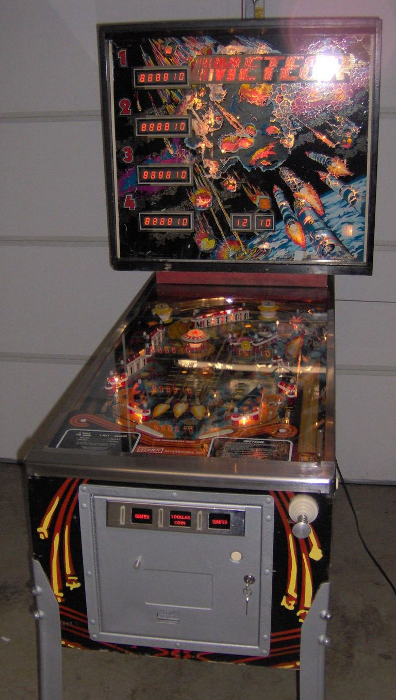

# Meteor Retheme

These are some notes to get started with the "Meteor Retheme Project" and to start some discussions.

The project will be a collaboration between Alex, Jackson and Chuck. 
The goal of this project is to build a pinball machine for fun.

Individuals pay as you go for parts: i.e. cabinets, controllers, custom boards, decals, playfield hardware etc.  The target for expenses is expected to be around $5000 (just to put a number on it), hopefully less if there can be deals found with multimorphics, nitro etc, for parts.

The roles and responsibilities will be loosely as follows:

* Alex - procurement, mechaninal
* Chuck - software, MPF, MCU drivers, custom hardware design if required. CNC.
* Jackson - PLayfield artwork. Display artwork, possibly animations etc. 
* All - game play rules, themes etc.

## Initial Thoughts:

The game will use the Meteor Cabinet:

It is unclear how much of the game will be used WRT the playfield etc, or if it is just the cabinet.

## Questions

1. What are we thinking for the playfield? use the existing playfield? make a new one? I (Chuck) will need a donor cabinet. If starting from scratch, this will be easier.
2. What is the box display. Replace with a LCD panel? both VFD and screen?
3. Hardware - I would recommend something like a [dell optiplex](https://www.memoryexpress.com/Products/MX00124892) they are $200 and have HD630 graphics. MFF. better than a PI etc
4. Controller? I am partial to multimorphic now, and already have expansion boards designed for LEDS, and drivers etc. But still open to suggestions.

# Note

    This document is publicly viewable for now, so nothing proprietary should appear here.

